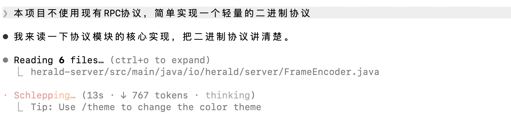

# AI 使用说明

---

## 0.我使用的prompt

### 现在有一道架构设计题，需要你做出方案并完成代码开发。

### 需求：
企业内部多个业务系统在关键事件发生时，需要调用外部系统供应商提供的 HTTP(S) API 进行通知。例如：
1. 用户通过第三方广告系统引流并成功注册后，通知对应的广告系统
2. 用户订阅付款成功后，通知 CRM 系统更改 Contact 状态
3. 用户购买商品后，通知库存系统进行库存变更
4. 不同供应商的 API请求地址不同、Header / Body 格式不同

#### 要求你：
请设计并实现一个内部服务，接收业务系统提交的外部 HTTP 通知请求，并尽可能可靠地投递到目标地址。本系统本身不需要关心外部 API 的返回值，只需确保通知请求能够被稳定、可靠地送达。

### 初步决策：
1. 实现简单的多节点集群模式，考虑使用类似Zookeeper的组件或者自研Raft协议组件实现分布式一致性，要求可扩展。
2. 考虑像Kafka一样设计，集群、Topic、Patition设计，做成Patition内有序。
3. 三个组件：生产端，服务端，消费端。
4. 尽可能高效，尽可能使用二进制序列化协议，不要使用HTTP
5. 要做到单机超大吞吐量，考虑借鉴Kafka的设计
6. 生产端、消费端调用做到简洁
7. 要做消息的持久化，保证消息在宕机时可以尽可能的恢复数据，参考RocketMQ的设计。

### 需要开发出的成果包括：
1. 可以容器化部署的服务端，可以作为依赖引入SpringBoot项目的生产端、消费端
2. 最小的使用示例：一个启动简单的生产端、消费端、服务端部署示例，使用SpringBoot；
3. 压测脚本与压测示例：测试服务端的吞吐量，可以使用常见的脚本；
4. 测试持久化可靠性：构造一个测试脚本测试关闭服务时的消息丢失数；
5. 完整的设计文档design.md；
6. 测试报告与指标；
7. 完整的部署、启动、使用教程README.md。

### 其他要求：
主系统要求Java开发，测试脚本最好用python；

### 你现在需要：
本轮对话理解我的需求并给出详尽的方案并写入设计文档，给整个开发流程分为几个阶段方便你生成代码。

## 1.开发前就做出的关键决策

### 投递语义

- 使用 at_least_once 至少一次语义。

- 原因：系统的首要要求是保证可靠性。使用至少一次语义可以最大限度保证，幂等性交给消费端处理

### 分布式一致性

- 使用Raft或类似协议实现。

- 原因：利用Raft完备的日志安全性保证，利用故障容错能力。同时Raft实现简单，比类似协议Paxos理论和实践上都简单许多。

### 有序设计参考Kafka

- 每个Broker内有多个Topic，每个Topic划分为多个Partition，仅在Patition内做有序

- 原因：兼顾性能、有序两个需求；提升水平扩展能力。

### 持久化能力参考现有MQ设计

- 原因：保证消息尽量不丢，全部宕机都可以恢复

### 测试

- 覆盖单元测试、集成测试、压测。尤其是压测，首要保证性能。

#### 其他见prompt中的初步决策章节。

## 2.开发过程中的关键决策

### 关于刷盘策略

- 使用两档可配置模式：async高吞吐档 / sync零丢失档

- 原因：系统的假定使用场景既有普通业务也有金融类要求做到强一致性的业务，为了保证最大化的通用性，设置两个模式并且可配置。

## 3.AI给出的未采纳建议

### 关于分布式一致性

- AI建议引入外部组件实现分布式一致性：不予采纳，要求AI自写轻量级Raft协议并在无相关上下文的另一个对话窗口进行测试

- 原因：尽量少的引入外部组件，做到极致轻量

### 关于传递协议

- AI建议使用gRPC：不予采纳。要求写一个最简单的二进制协议，只利用Hetty。

- 原因：追求极致的吞吐量，HTTP/gRPC/Thrift 这类现成协议有 HTTP 头/JSON 元数据开销、序列化反射开销，全部规避，追求极低的每桢开销

## 4.AI的关键帮助

- 持久化的选择：参考RMQ的commitLog
- 引入死信队列：重试仍然失败的任务写入死信队列供排查与重放
- 拷贝：使用类似Linux底层的mmap读取，避免用户态拷贝
- 长连接：调研、使用Netty的单机支撑数十万连接的能力
- 测试方面：调研py测试条件，编写可靠的py测试脚本
- 部署：调研并实现支持容器化部署
