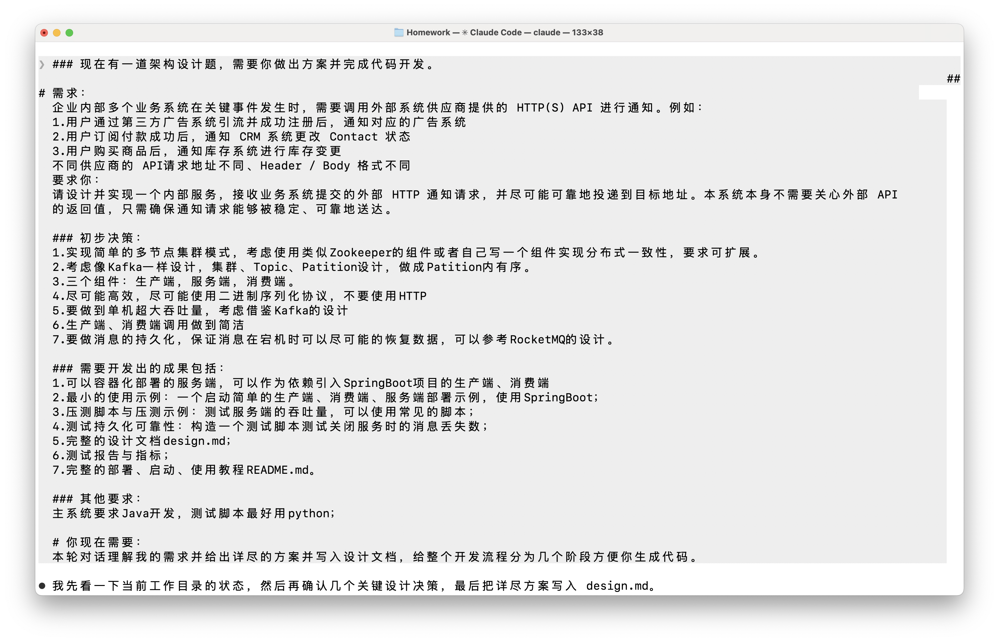

# Herald — 可靠外部通知投递服务 设计文档

> 版本：v1.0（定稿）
> 状态：已实现（阶段 0–9 全部完成）
> 目标：一个内部服务，接收业务系统的外部 HTTP 通知请求，并尽可能可靠、稳定地投递到目标供应商 API。

---

## 0.我使用的prompt

### 现在有一道架构设计题，需要你做出方案并完成代码开发。

### 需求：
企业内部多个业务系统在关键事件发生时，需要调用外部系统供应商提供的 HTTP(S) API 进行通知。例如：
1.用户通过第三方广告系统引流并成功注册后，通知对应的广告系统
2.用户订阅付款成功后，通知 CRM 系统更改 Contact 状态
3.用户购买商品后，通知库存系统进行库存变更
不同供应商的 API请求地址不同、Header / Body 格式不同
要求你：
请设计并实现一个内部服务，接收业务系统提交的外部 HTTP 通知请求，并尽可能可靠地投递到目标地址。本系统本身不需要关心外部 API 的返回值，只需确保通知请求能够被稳定、可靠地送达。

### 初步决策：
1.实现简单的多节点集群模式，考虑使用类似Zookeeper的组件或者自研Raft协议组件实现分布式一致性，要求可扩展。
2.考虑像Kafka一样设计，集群、Topic、Patition设计，做成Patition内有序。
3.三个组件：生产端，服务端，消费端。
4.尽可能高效，尽可能使用二进制序列化协议，不要使用HTTP
5.要做到单机超大吞吐量，考虑借鉴Kafka的设计
6.生产端、消费端调用做到简洁
7.要做消息的持久化，保证消息在宕机时可以尽可能的恢复数据，参考RocketMQ的设计。

### 需要开发出的成果包括：
1.可以容器化部署的服务端，可以作为依赖引入SpringBoot项目的生产端、消费端
2.最小的使用示例：一个启动简单的生产端、消费端、服务端部署示例，使用SpringBoot；
3.压测脚本与压测示例：测试服务端的吞吐量，可以使用常见的脚本；
4.测试持久化可靠性：构造一个测试脚本测试关闭服务时的消息丢失数；
5.完整的设计文档design.md；
6.测试报告与指标；
7.完整的部署、启动、使用教程README.md。

### 其他要求：
主系统要求Java开发，测试脚本最好用python；

### 你现在需要：
本轮对话理解我的需求并给出详尽的方案并写入设计文档，给整个开发流程分为几个阶段方便你生成代码。



## 1. 概述

### 1.1 背景

企业内部多个业务系统在关键事件发生时，需要调用外部供应商的 HTTP(S) API 进行通知：

| 场景   | 事件          | 目标系统              |
|------|-------------|-------------------|
| 用户注册 | 第三方广告引流注册成功 | 广告系统              |
| 订阅付款 | 付款成功        | CRM（改 Contact 状态） |
| 购买商品 | 下单成功        | 库存系统（库存变更）        |

不同供应商的 **请求地址**、**Header**、**Body** 格式各不相同。本系统不关心外部 API 的返回值语义，只保证通知请求能被稳定、可靠地送达。

### 1.2 目标（Goals）

1. **解耦**：业务系统只把"要发一个 HTTP 通知"这件事交给本服务，不感知供应商差异、网络抖动、限流重试。
2. **可靠投递**：消息持久化，宕机可恢复；投递失败自动重试；至少一次（at-least-once）语义。
3. **高吞吐**：单机超大吞吐量，借鉴 Kafka 的批量、顺序写、零拷贝设计。
4. **可扩展**：多节点集群、分区水平扩展、分区内有序。
5. **易接入**：生产端/消费端以 Spring Boot Starter 依赖引入，API 简洁。

### 1.3 非目标（Non-Goals）

- 不实现 **精确一次（exactly-once）** 语义（通知类场景允许重复，靠下游幂等去重）。
- 不解析/校验外部 API 的响应体内容（只判断投递是否"成功"，响应体丢弃）。
- 不实现完整的 Kafka/RocketMQ 协议兼容（这是自研精简系统，非替代品）。
- 不提供事务消息、消息轨迹、SQL 过滤等重型企业特性（可作为后续扩展）。

### 1.4 关键术语

| 术语             | 含义                                  |
|----------------|-------------------------------------|
| Topic          | 逻辑队列，通常对应一类通知（或一个目标系统）              |
| Partition      | 分区，Topic 的并行单元，**分区内严格有序**          |
| Message        | 一条通知请求（含 URL/Method/Headers/Body）   |
| Offset         | 消息在分区内的单调递增序号                       |
| Broker         | 服务端节点，负责存储、复制、分发                    |
| Producer       | 生产端，业务系统用来发送通知                      |
| Consumer       | 消费端，拉取消息并**实际发起外部 HTTP 调用**         |
| Consumer Group | 消费组，组内共同消费一个 Topic 的分区              |
| ISR            | In-Sync Replicas，与 Leader 保持同步的副本集合 |
| Raft           | 内嵌共识组件，负责选主与元数据一致性                  |
| DLQ            | Dead Letter Queue，投递多次失败后的死信队列      |

---

## 2. 总体架构

### 2.1 组件拓扑

```
                     ┌─────────────────────────────────────────────┐
                     │              Broker 集群 (服务端)             │
 业务系统 A ──(send)─▶│  ┌──────────┐  ┌──────────┐  ┌──────────┐  │
 业务系统 B ──(send)─▶│  │ Broker-1 │  │ Broker-2 │  │ Broker-3 │  │
 业务系统 C ──(send)─▶│  │ leader P0│  │leader P1 │  │leader P2 │  │
 (Producer SDK)       │  └──────────┘  └──────────┘  └──────────┘  │
                      └───────────────┬─────────────────────────────┘
                                      │ 二进制 TCP 协议 (Netty)
                                      ▼
                     ┌─────────────────────────────────────────────┐
                     │          投递消费端 (Consumer SDK)            │
                     │  拉取消息 → 发起外部 HTTP 调用 → 提交 Offset   │
                     └───────────────┬─────────────────────────────┘
                                     │ HTTP(S)
                        ┌────────────┼────────────┐
                        ▼            ▼            ▼
                   广告系统        CRM 系统       库存系统
```

### 2.2 三个角色

1. **生产端（Producer）**：业务系统内嵌的 SDK，把通知请求异步批量发送到 Broker。API 极简：`client.send(topic, request)`。
2. **服务端（Broker）**：存储 + 复制 + 分发。每个节点 = Netty 数据面 + 存储引擎 + Raft 控制面。
3. **消费端（Consumer）**：SDK，连接 Broker 拉取消息，内置 **HTTP 投递器** 完成对供应商 API 的实际调用，成功后提交 offset，失败重试，超限进死信。

> 关键设计：**消息本身携带完整 HTTP 请求信息**（url / method / headers / body），因此消费端无需为每个供应商写定制投递代码，一个通用的投递器即可覆盖所有场景，做到"调用简洁"。

### 2.3 集群模型（借鉴 Kafka）

- 集群由多个 Broker 组成，每个 Topic 划分为多个 Partition。
- Partition 是**有序、不可变、追加写**的日志；分区内 offset 单调递增、严格有序。
- 每个 Partition 有 1 个 Leader 和 R-1 个 Follower（复制因子 R）。
- 读写都走 Leader；Follower 异步拉取同步。
- 分区可以水平扩展（加分区 / 加机器），吞吐线性增长。

---

## 3. 核心设计决策

| # | 决策                                             | 理由                                     |
|---|------------------------------------------------|----------------------------------------|
| 1 | **自研内嵌 Raft**（不做 ZK / etcd 依赖）                 | 一个镜像即可组集群，容器化部署最简单；满足"自己写组件实现分布式一致性"   |
| 2 | **Raft 只管控制面，数据面用 Kafka 式 ISR 复制**             | Raft 逐条消息复制会串行化写入、拖垮吞吐；数据复制用异步 ISR 更高效 |
| 3 | **分区追加写日志（Kafka 式）+ 段文件 + mmap（RocketMQ 式刷盘）** | 顺序 I/O 命中页缓存，兼顾吞吐与持久化                  |
| 4 | **自定义二进制协议（Netty + 手写 codec），不用 HTTP**         | 极低开销，满足"尽可能高效、二进制序列化"                  |
| 5 | **双模式可配置刷盘**                                   | 同一套代码切换"高吞吐"与"零丢失"两档，压测分别给数据           |
| 6 | **至少一次语义**                                     | 通知场景允许重复，下游幂等即可；实现简单可靠                 |
| 7 | **Pull 拉取 + 批量投递**                             | 消费端自主控制节奏，避免推送打爆下游                     |

### 3.1 Raft 与 ISR 复制的职责划分

| 关注点                       | 机制                     | 数据量 | 一致性              |
|---------------------------|------------------------|-----|------------------|
| Broker 注册 / 心跳            | Raft 状态机               | 低频  | 强一致              |
| Topic / Partition / 副本分配  | Raft 状态机               | 低频  | 强一致              |
| 消费组成员 / 分区分配 / 已提交 offset | Raft 状态机               | 低频  | 强一致              |
| **消息数据**                  | Leader→Follower ISR 复制 | 高频  | 最终一致（可配置 ack 级别） |

---

## 4. 数据模型与消息格式

### 4.1 Message 结构

```java
public class Message {
    long   messageId;   // 全局唯一（snowflake）
    long   offset;      // 分区内偏移（Broker 分配）
    String topic;
    int    partition;
    String key;         // 可选，用于分区路由
    long   createTime;
    long   expireTime;  // 可选，投递过期时间（超时不再投递）
    int    retryCount;  // 已投递次数
    String url;         // 目标 URL（必填）
    String method;      // HTTP method（GET/POST/...）
    Map<String,String> headers;  // 目标 Header（鉴权等）
    byte[] body;        // 目标 Body（原始字节）
    int    flags;       // 位标志：压缩/加密等
}
```

### 4.2 二进制编解码（codec）

- 整数采用 **VarInt**（protobuf 风格），字符串/字节数组采用 `varint 长度 + 数据` 前缀。
- 优点：无反射、无对象头膨胀、无跨语言障碍（Python 压测脚本可直连协议）。

**字段编码顺序**：`topic → partition → key → url → method → headers(条目数+KV) → body → flags`

### 4.3 消息 ID（snowflake）

```
+--------+------------------+------------+-----------+
| 1 bit  | 41 bits 时间戳   | 10 bits 节点| 12 bits 序列|
+--------+------------------+------------+-----------+
```
Broker 侧分配 messageId，保证全局唯一；同时作为幂等键，供下游去重。

---

## 5. 存储引擎

### 5.1 分区日志与段（Segment）

```
data/
└── {topic}/
    └── {partition}/
        ├── 00000000000000000000.log     # 段数据（消息二进制）
        ├── 00000000000000000000.index   # 稀疏索引（offset → 文件位置）
        └── ...
```

- 每个 Partition 是一条**追加写**日志，按段切分（默认 512MB / 段）。
- 段文件名为该段起始 offset（20 位右对齐）。
- **写路径**：追加到当前活跃段（FileChannel，页缓存），按策略批量 `fsync`。
- **读路径**：段文件 `mmap` 映射，实现零拷贝读取。

### 5.2 稀疏索引（Offset Index）

- 每写入 N 条（或 N 字节，如 4KB）记录一条 `(相对offset, 文件位置)`。
- 查某 offset 时：二分定位段 → 二分定位索引 → 顺序扫到目标消息。
- 稀疏索引用 `mmap` 维护，占用极小。

### 5.3 刷盘策略（双模式可配置）

| 配置项 | 高吞吐模式（默认） | 零丢失模式 |
|--------|-------------------|-----------|
| `flush.mode` | `async` | `sync` |
| `flush.interval.ms` | 100 | — |
| `flush.messages` | 10000 | 1（每条） |
| `replication.acks` | `1`（leader） | `-1`（ISR 全确认） |

- **高吞吐**：批量异步刷盘，依赖 OS 页缓存，宕机最多丢一个刷盘窗口（靠副本 + 重放尽量恢复）。
- **零丢失**：每条消息刷盘 + ISR 全确认后才会 ack 给生产端，宕机不丢。

### 5.4 清理策略（Retention）

- 按时间（默认 7 天）或按分区大小（默认 10GB）清理旧段。
- 只有非活跃段可被删除；活跃段永不删除。

### 5.5 崩溃恢复

- 启动时扫描每个分区的段文件：找到活跃段，从最后一个完整记录处截断（丢弃半写尾部）。
- 重建索引（从日志重放）或校验已有索引。
- 恢复时以 `fsync` 边界保证一致性（半写消息被丢弃，不产生脏数据）。

---

## 6. 网络协议（二进制 TCP）

### 6.1 帧格式

```
+---------+----------+---------+-----------+---------------+---------+
| magic   | version  | opcode  | frameLen  | header(变长)  | body    |
| 2 bytes | 1 byte   | 1 byte  | 4 bytes   | 键值对        | 原始字节 |
+---------+----------+---------+-----------+---------------+---------+
```

- `magic = 0x4845`（"HE"），`version = 1`
- `frameLen` = header + body 的总长度（用于粘包/拆包）
- header 为长度前缀的 KV（requestId、topic、partition、ack 级别等）
- body 为消息二进制（或批量消息）

### 6.2 Opcode 一览

| Opcode | 名称 | 方向 | 说明 |
|--------|------|------|------|
| 0x01 | PRODUCE | P→B | 发送（可批量）消息 |
| 0x02 | PRODUCE_ACK | B→P | 写入确认（含 offset） |
| 0x03 | FETCH | C→B | 拉取消息（含起始 offset、批量上限） |
| 0x04 | FETCH_RESPONSE | B→C | 返回消息批次 |
| 0x05 | COMMIT_OFFSET | C→B | 提交已处理 offset |
| 0x06 | COMMIT_ACK | B→C | 提交确认 |
| 0x07 | METADATA | P/C→B | 查询 topic/分区/leader 元数据 |
| 0x08 | METADATA_RESPONSE | B→P/C | 元数据返回 |
| 0x09 | HEARTBEAT | P/C→B | 心跳 / 保活 |
| 0x0A | REPLICA_FETCH | B→B | Follower 拉取副本数据 |
| 0x0B | REPLICA_RESPONSE | B→B | 副本数据返回 |
| 0x0C | RAFT_* | B→B | Raft 内部消息（RequestVote/AppendEntries） |

### 6.3 关键交互时序

**生产（批量）**：
```
Producer ──PRODUCE(batch)──▶ Leader Broker ──append log──▶ fsync? ──replicate to ISR──▶ PRODUCE_ACK(offsets)
```

**消费（拉取 + 投递）**：
```
Consumer ──FETCH(offset)──▶ Broker ──FETCH_RESPONSE(batch)──▶ Consumer ──HTTP POST──▶ 供应商
   ◀──COMMIT_ACK──────────◀──COMMIT_OFFSET(offset+n)────────┘
```

---

## 7. 生产端设计（Producer SDK）

### 7.1 API（极简）

```java
// 同步
SendResult result = producer.send(
    "user-registered",                          // topic
    new Notification("https://ad.example.com/callback",
                     "POST",
                     Map.of("Authorization", "Bearer xxx"),
                     bodyBytes));

// 异步
producer.sendAsync("user-registered", req)
        .thenAccept(result -> log.info("offset={}", result.offset()));
```

### 7.2 关键机制

1. **累加器批量**（借鉴 Kafka RecordAccumulator）：按 `linger.ms` + `batch.size` 聚批，一批一帧发给 Broker。
2. **分区选择**：指定 key 则 `hash(key) % partitions`；否则轮询，保证负载均衡。
3. **重试**：网络错误/超时自动重试（可配置次数），依赖 `requestId` 去重避免重复。
4. **元数据缓存**：缓存 topic→partition→leader 映射，定时刷新，leader 切换时自动更新。
5. **连接池**：对每个 Broker 维持长连接（Netty channel 池）。

### 7.3 Spring Boot Starter

- `herald-producer-spring-boot-starter`：自动装配 `HeraldProducer` Bean。
- 配置前缀 `herald.producer.*`（bootstrap servers、linger、batch、acks、retries 等）。
- `@EnableHeraldProducer` 开关注入。

---

## 8. 消费端设计（Consumer SDK）

### 8.1 API（极简，内置投递器）

```java
// 消费端几乎零代码：SDK 内置通用 HTTP 投递器
HeraldConsumer consumer = HeraldConsumer.builder()
    .bootstrapServers("node1:9090,node2:9090")
    .groupId("crm-notifier")
    .topics("user-subscribed")
    .deliveryConfig(DeliveryConfig.builder()
        .maxRetries(5)
        .retryBackoffMs(1000)
        .timeoutMs(5000)
        .build())
    .build();
consumer.start();
```

### 8.2 工作机制

1. **拉取模型**：长轮询 `FETCH`，批量取回消息。
2. **分组协作**：同一 Consumer Group 内分区分配（JoinGroup/SyncGroup 经 Raft 协调，协作式 rebalance）。
3. **投递器**：对批次内每条消息并发发起 HTTP 调用（async HTTP client）。
4. **成功判定**：HTTP 状态码 `2xx/3xx` 视为成功（响应体丢弃）；`4xx/5xx`/超时/连接失败视为失败。
5. **重试**：失败按退避策略重试（指数退避 + 抖动），达上限进 **DLQ**。
6. **Offset 提交**：批次投递成功后提交 offset（可配置自动/手动，默认批量自动提交）。
7. **重平衡**：新增/下线消费者时，分区重新分配，避免重复消费窗口。

### 8.3 死信（DLQ）

- 重试 `maxRetries` 次仍失败 → 写入 `{topic}.DLQ` 内部主题。
- DLQ 保留原始消息 + 失败原因 + 失败时间，供人工排查/重放。

### 8.4 Spring Boot Starter

- `herald-consumer-spring-boot-starter`：自动装配 `HeraldConsumer`。
- 配置前缀 `herald.consumer.*`（group、topics、投递并发度、重试、超时等）。
- 通过 `DeliveryHandler` SPI 可自定义投递逻辑（默认走通用 HTTP 投递器）。

---

## 9. 集群与一致性

### 9.1 内嵌 Raft（控制面）

- 每个 Broker 内嵌一个 Raft 节点，Raft 组覆盖所有 Broker。
- **状态机**：存储集群元数据（见 3.1 表格），通过 Raft 日志复制达成强一致。
- 职责：Leader 选举、Broker 注册/心跳、Topic/Partition 元数据、副本/ISR 管理、消费组协调、offset 提交。

### 9.2 数据复制（数据面，Kafka 式）

- 每个 Partition 有 Leader + Follower。
- Producer 只写 Leader；Leader 追加日志后异步推送给 Follower（`REPLICA_FETCH` 增量拉取）。
- **ISR**：与 Leader 落后量在阈值内的 Follower 集合；落后则踢出，追上再加回。
- **Ack 级别**：
  - `acks=0`：不等确认（吞吐最高，可能丢）
  - `acks=1`：Leader 确认即返回（默认高吞吐档）
  - `acks=-1`：ISR 全确认（零丢失档）
- **Leader 切换**：Leader 失效时，由 Raft 控制面在 ISR 中选新 Leader。

---

## 10. 可靠性保证

### 10.1 语义

**至少一次（at-least-once）**。允许重复投递，下游需幂等（可用 messageId 去重）。

### 10.2 故障场景分析

| 故障 | 影响 | 恢复 |
|------|------|------|
| Broker 进程崩溃 | 未刷盘消息丢失（高吞吐档） | 从副本/重放恢复；零丢失档不丢 |
| Broker 宕机（机器重启） | Leader 失效 | Raft 选新 Leader，客户端重定向 |
| Follower 落后/宕机 | 副本可用性下降 | ISR 机制踢出/追回 |
| 网络分区 | 脑裂风险 | Raft 多数派保证无脑裂 |
| 消费端投递中崩溃 | 已投递未提交 offset | 重启后从上次 offset 重投（可能重复） |
| 外部 API 长期不可用 | 消息堆积 | 重试 + 退避 + DLQ，不丢不阻塞 |

### 10.3 丢失边界（压测重点）

- **高吞吐档**：崩溃瞬间丢失 = 一个刷盘窗口内（默认 ≤100ms）且未同步副本的消息。
- **零丢失档**：丢失 = 0（每条同步刷盘 + ISR 全确认）。
- 可靠性测试脚本将量化验证上述边界。

---

## 11. 可观测性

- **指标**：吞吐（msg/s）、投递延迟（p50/p99）、队列堆积量、重试次数、失败率、DLQ 数量、分区/副本状态、刷盘耗时。
- **实现**：Micrometer 打点，暴露 Prometheus 端点（`/metrics`）。
- **日志**：结构化日志，含 messageId / topic / partition / offset 关联字段。

---

## 12. 性能设计要点（借鉴 Kafka）

1. **顺序追加写**：每分区单活跃段顺序写，命中页缓存。
2. **批量**：生产端累加器聚批、消费端批量拉取、批量刷盘。
3. **零拷贝**：mmap 读取，避免用户态拷贝。
4. **异步刷盘**：批量 `fsync`，写吞吐不阻塞在磁盘同步上。
5. **二进制协议**：无 HTTP 头/JSON 开销，VarInt 紧凑编码。
6. **长连接 + 事件驱动**：Netty 单机支撑数十万连接，无线程爆炸。

### 12.1 性能目标与实测（1KB 消息，单节点，2 连接）

| 模式 | flush | acks | 目标 | 实测吞吐 | 实测 ack 延迟 p50/p99/p99.9 |
|------|-------|------|------|----------|------------------------------|
| 高吞吐档 | async | 0 | ≥ 100,000 msg/s | ~341k msg/s | —（无 ack） |
| 高吞吐档 | async | 1 | ≥ 100,000 msg/s | ~386k msg/s | 1.15 / 15.8 / 16.2 ms |
| 高吞吐档 | async | -1 (RF=1) | ≥ 100,000 msg/s | ~386k msg/s | 1.19 / 15.2 / 21.2 ms |
| 零丢失档 | sync | -1 | ≥ 10,000 msg/s | ~33k msg/s | 29.1 / 61.4 / 62.1 ms |

> 实测数值由 `herald-scripts/benchmark.py` 直连二进制协议测得，详细数据与丢失测试见 `docs/test-report.md`。

---

## 13. 技术选型

| 项 | 选型 | 说明 |
|----|------|------|
| 语言 | Java 17 | 主系统 |
| 网络 | Netty 4.1 | 高吞吐事件驱动 |
| 框架 | Spring Boot 3.5.16 | 示例 + Starter |
| 构建 | Maven 多模块 | 依赖管理清晰 |
| 序列化 | 自定义二进制 codec | 极低开销、跨语言可重实现 |
| 一致性 | 自研内嵌 Raft | 无外部依赖 |
| 压缩 | LZ4（可选） | 批量消息压缩 |
| 指标 | Micrometer + Prometheus | 监控 |
| 测试脚本 | Python 3.11 | 压测/可靠性脚本 |
| 部署 | Docker / docker-compose | 容器化 |

---

## 14. 工程结构

```
herald/
├── pom.xml                                  # 父 POM
├── herald-common/                           # 消息模型、配置、snowflake、工具
├── herald-protocol/                         # 二进制编解码、帧、opcode
├── herald-storage/                          # 存储引擎（段/索引/刷盘/恢复）
├── herald-raft/                             # 内嵌 Raft（选举/日志/状态机/元数据）
├── herald-server/                           # Broker（Netty 数据面 + 分区管理 + 复制）
├── herald-producer/                         # 生产端 core
├── herald-producer-spring-boot-starter/     # 生产端 Starter
├── herald-consumer/                         # 消费端 core + HTTP 投递器
├── herald-consumer-spring-boot-starter/     # 消费端 Starter
├── herald-examples/
│   ├── producer-example/                    # 最小生产端示例（Spring Boot）
│   ├── consumer-example/                    # 最小消费端示例（Spring Boot）
│   └── server-example/                      # 服务端启动示例
├── herald-scripts/                          # Python 压测 / 可靠性测试脚本
├── docker/                                  # Dockerfile / docker-compose
├── design.md                                # 本文档（设计文档）
├── README.md                                # 部署、启动、使用教程
└── docs/
    └── test-report.md                       # 测试报告与指标（吞吐/延迟/丢失）
```

---

## 15. 开发阶段划分

> 每阶段结束可独立编译、可测试，形成增量交付。

### 阶段 0：工程骨架
- 初始化 Maven 多模块工程、包结构、依赖版本、日志配置。
- **产出**：可 `mvn install` 的空工程。

### 阶段 1：存储引擎（herald-storage）
- 实现段文件、追加写、mmap 读、稀疏索引、双模式刷盘、崩溃恢复。
- **产出**：存储模块 + 单元测试 + 微型 benchmark。

### 阶段 2：二进制协议 + Broker 单机核心（herald-protocol / herald-server）
- 实现 codec、帧编解码、Netty Server、Topic/Partition 内存管理 + 存储接入、PRODUCE/FETCH/COMMIT 处理。
- **产出**：单机 Broker 可跑，可用脚本直连读写。

### 阶段 3：生产端 SDK（herald-producer + starter）
- 累加器批量、分区选择、重试、元数据缓存、连接池、Spring Boot Starter。
- **产出**：生产端可依赖引入。

### 阶段 4：消费端 SDK + 投递器（herald-consumer + starter）
- 拉取、offset 提交、分组协调、通用 HTTP 投递器（重试/退避/DLQ）、Spring Boot Starter。
- **产出**：消费端可依赖引入，端到端跑通。

### 阶段 5：集群与一致性（herald-raft + server 复制）
- 内嵌 Raft（选举/日志/状态机）、Broker 注册发现、副本复制（ISR）、Leader 切换。
- **产出**：多节点集群可部署。

### 阶段 6：可靠性加固
- 崩溃恢复验证、双模式刷盘/复制配置矩阵验证、DLQ 与重试边界。
- **产出**：可靠性测试通过。

### 阶段 7：示例与容器化部署
- 三个 Spring Boot 示例、Dockerfile、docker-compose 一键起集群。
- **产出**：可容器化部署的服务端 + 最小示例。

### 阶段 8：压测与可靠性测试脚本（Python）
- 压测脚本（直连二进制协议测 Broker 吞吐）、消息丢失测试脚本（杀进程测丢失数）。
- **产出**：`herald-scripts/` 脚本。

### 阶段 9：文档与测试报告
- 定稿 design.md、编写 README.md、整理 test-report.md（吞吐/延迟/丢失数）。
- **产出**：完整交付文档。

---

## 16. 风险与权衡

| 风险 | 影响 | 缓解 |
|------|------|------|
| 自研 Raft 正确性难保证 | 脑裂/元数据不一致 | 精简 Raft 子集 + 充分故障注入测试 |
| 自研二进制协议易出边界 bug | 粘包/解包错误 | 编解码单测 + 跨语言（Python）互测 |
| 高吞吐与零丢失不可兼得 | 语义冲突 | 双模式配置切换，明确各自边界 |
| 复制延迟导致副本不一致 | 切换时丢消息 | ISR 阈值 + acks=-1 档兜底 |

---

## 17. 待确认项

- [x] 协调组件：自研内嵌 Raft
- [x] 刷盘取向：双模式可配置
- [x] 项目名/包名：`Herald` / `io.herald`（已定稿）
- [x] 性能目标具体数值：已压测校准（见 §12.1 与 `docs/test-report.md`）
